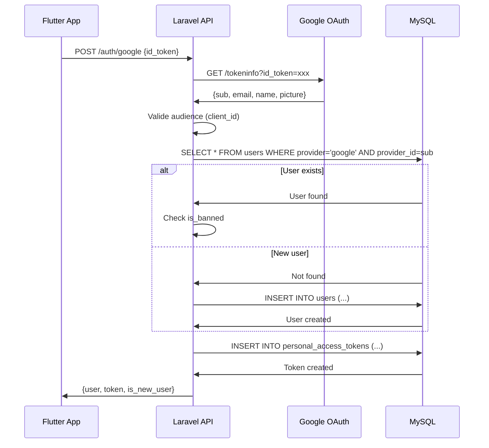

# 11. Architecture Backend (Laravel)

## 11.1 Architecture des Services

```
app/
├── Console/
│   └── Commands/
│       └── CalculateTrustScores.php    # Commande scheduled
│
├── Http/
│   ├── Controllers/
│   │   ├── Api/
│   │   │   ├── AuthController.php
│   │   │   ├── QuestionController.php
│   │   │   ├── AnswerController.php
│   │   │   ├── ProfileController.php
│   │   │   ├── NotificationController.php
│   │   │   └── ReportController.php
│   │   └── Admin/
│   │       ├── DashboardController.php
│   │       ├── ModerationController.php
│   │       └── UserController.php
│   │
│   ├── Middleware/
│   │   ├── EnsureUserNotBanned.php
│   │   └── AdminAuthenticate.php
│   │
│   ├── Requests/
│   │   ├── CreateQuestionRequest.php
│   │   ├── CreateAnswerRequest.php
│   │   ├── RateAnswerRequest.php
│   │   └── UpdateProfileRequest.php
│   │
│   └── Resources/
│       ├── QuestionResource.php
│       ├── AnswerResource.php
│       ├── UserResource.php
│       └── NotificationResource.php
│
├── Models/
│   ├── User.php
│   ├── Question.php
│   ├── Answer.php
│   ├── Rating.php
│   ├── Report.php
│   ├── Notification.php
│   └── Admin.php
│
├── Repositories/
│   ├── Contracts/
│   │   ├── QuestionRepositoryInterface.php
│   │   └── UserRepositoryInterface.php
│   └── Eloquent/
│       ├── QuestionRepository.php
│       └── UserRepository.php
│
├── Services/
│   ├── AuthService.php
│   ├── QuestionService.php
│   ├── AnswerService.php
│   ├── TrustScoreService.php
│   ├── NotificationService.php
│   ├── FCMService.php
│   └── StorageService.php
│
├── Events/
│   ├── AnswerCreated.php
│   ├── QuestionCreated.php
│   └── AnswerRated.php
│
├── Listeners/
│   ├── SendNewAnswerNotification.php
│   ├── NotifyNearbyLocalSupporters.php
│   └── UpdateTrustScore.php
│
└── Observers/
    ├── AnswerObserver.php
    └── RatingObserver.php

routes/
├── api.php          # Routes API REST
├── admin.php        # Routes admin web
└── channels.php     # Broadcasting channels (si WebSocket futur)

config/
├── services.php     # Configuration services externes
├── firebase.php     # Configuration FCM
└── filesystems.php  # Configuration OVH Object Storage
```

## 11.2 Controller Template

```php
<?php

namespace App\Http\Controllers\Api;

use App\Http\Controllers\Controller;
use App\Http\Requests\CreateQuestionRequest;
use App\Http\Resources\QuestionResource;
use App\Services\QuestionService;
use Illuminate\Http\JsonResponse;
use Illuminate\Http\Request;
use Illuminate\Http\Resources\Json\AnonymousResourceCollection;

class QuestionController extends Controller
{
    public function __construct(
        private readonly QuestionService $questionService
    ) {}

    /**
     * Liste des questions géolocalisées ou par fil d'actualité
     */
    public function index(Request $request): AnonymousResourceCollection
    {
        $request->validate([
            'lat' => 'required_without:sort|numeric|between:-90,90',
            'lng' => 'required_without:sort|numeric|between:-180,180',
            'radius' => 'nullable|integer|min:1|max:50',
            'sort' => 'nullable|in:recent,popular',
            'city' => 'nullable|string|max:100',
        ]);

        if ($request->has('lat') && $request->has('lng')) {
            $questions = $this->questionService->getNearbyQuestions(
                latitude: $request->float('lat'),
                longitude: $request->float('lng'),
                radiusKm: $request->integer('radius', 10),
                page: $request->integer('page', 1)
            );
        } else {
            $questions = $this->questionService->getFeedQuestions(
                sort: $request->string('sort', 'recent'),
                city: $request->string('city'),
                page: $request->integer('page', 1)
            );
        }

        return QuestionResource::collection($questions);
    }

    /**
     * Créer une nouvelle question
     */
    public function store(CreateQuestionRequest $request): JsonResponse
    {
        $question = $this->questionService->createQuestion(
            user: $request->user(),
            data: $request->validated()
        );

        return response()->json([
            'data' => new QuestionResource($question)
        ], 201);
    }

    /**
     * Détail d'une question avec ses réponses
     */
    public function show(int $id): JsonResponse
    {
        $question = $this->questionService->getQuestionWithAnswers($id);

        return response()->json([
            'data' => new QuestionResource($question)
        ]);
    }
}
```

## 11.3 Schéma et Data Access Layer

```php
<?php

namespace App\Repositories\Eloquent;

use App\Models\Question;
use App\Repositories\Contracts\QuestionRepositoryInterface;
use Illuminate\Contracts\Pagination\LengthAwarePaginator;
use Illuminate\Support\Facades\DB;

class QuestionRepository implements QuestionRepositoryInterface
{
    public function __construct(
        private readonly Question $model
    ) {}

    /**
     * Récupère les questions dans un rayon géographique
     */
    public function findNearby(
        float $latitude,
        float $longitude,
        int $radiusKm,
        int $perPage = 20
    ): LengthAwarePaginator {
        $radiusMeters = $radiusKm * 1000;

        return $this->model
            ->select([
                'questions.*',
                DB::raw("ST_Distance_Sphere(
                    location,
                    ST_SRID(POINT({$longitude}, {$latitude}), 4326)
                ) as distance_meters")
            ])
            ->whereRaw("ST_Distance_Sphere(
                location,
                ST_SRID(POINT(?, ?), 4326)
            ) <= ?", [$longitude, $latitude, $radiusMeters])
            ->where('is_deleted', false)
            ->with(['user:id,name,avatar_url,user_type,trust_score'])
            ->orderByDesc('created_at')
            ->paginate($perPage);
    }

    /**
     * Récupère les questions pour le fil d'actualité
     */
    public function findForFeed(
        string $sort = 'recent',
        ?string $city = null,
        int $perPage = 20
    ): LengthAwarePaginator {
        $query = $this->model
            ->where('is_deleted', false)
            ->with(['user:id,name,avatar_url,user_type,trust_score']);

        if ($city) {
            $query->where('city', $city);
        }

        if ($sort === 'popular') {
            $query->orderByDesc('answers_count');
        } else {
            $query->orderByDesc('created_at');
        }

        return $query->paginate($perPage);
    }

    /**
     * Crée une question avec point géographique
     */
    public function create(array $data): Question
    {
        // Créer le point spatial
        $data['location'] = DB::raw(
            "ST_SRID(POINT({$data['longitude']}, {$data['latitude']}), 4326)"
        );

        return $this->model->create($data);
    }
}
```

## 11.4 Authentification et Autorisation

```php
<?php

namespace App\Services;

use App\Models\User;
use Illuminate\Support\Facades\Http;
use Laravel\Socialite\Facades\Socialite;
use Laravel\Sanctum\NewAccessToken;

class AuthService
{
    /**
     * Authentification via Google ID Token
     */
    public function authenticateWithGoogle(string $idToken): array
    {
        // Valider le token avec Google
        $response = Http::get('https://oauth2.googleapis.com/tokeninfo', [
            'id_token' => $idToken,
        ]);

        if ($response->failed()) {
            throw new \InvalidArgumentException('Invalid Google token');
        }

        $googleUser = $response->json();

        // Vérifier l'audience (client ID)
        if ($googleUser['aud'] !== config('services.google.client_id')) {
            throw new \InvalidArgumentException('Invalid token audience');
        }

        return $this->findOrCreateUser(
            provider: 'google',
            providerId: $googleUser['sub'],
            email: $googleUser['email'],
            name: $googleUser['name'] ?? 'Utilisateur',
            avatarUrl: $googleUser['picture'] ?? null
        );
    }

    /**
     * Authentification via Apple Identity Token
     */
    public function authenticateWithApple(
        string $identityToken,
        string $authorizationCode,
        ?array $fullName = null
    ): array {
        // Utiliser Socialite pour valider le token Apple
        $appleUser = Socialite::driver('apple')
            ->stateless()
            ->userFromToken($identityToken);

        $name = 'Utilisateur';
        if ($fullName) {
            $name = trim(($fullName['given_name'] ?? '') . ' ' . ($fullName['family_name'] ?? ''));
            if (empty($name)) {
                $name = 'Utilisateur';
            }
        }

        return $this->findOrCreateUser(
            provider: 'apple',
            providerId: $appleUser->getId(),
            email: $appleUser->getEmail(),
            name: $name,
            avatarUrl: null
        );
    }

    /**
     * Trouve ou crée un utilisateur
     */
    private function findOrCreateUser(
        string $provider,
        string $providerId,
        string $email,
        string $name,
        ?string $avatarUrl
    ): array {
        $isNewUser = false;

        $user = User::where('provider', $provider)
            ->where('provider_id', $providerId)
            ->first();

        if (!$user) {
            // Vérifier si l'email existe déjà avec un autre provider
            $existingUser = User::where('email', $email)->first();

            if ($existingUser) {
                throw new \InvalidArgumentException(
                    'Un compte existe déjà avec cet email via un autre fournisseur'
                );
            }

            $user = User::create([
                'email' => $email,
                'name' => $name,
                'avatar_url' => $avatarUrl,
                'provider' => $provider,
                'provider_id' => $providerId,
                'user_type' => 'traveler',
            ]);

            $isNewUser = true;
        }

        // Vérifier si l'utilisateur est banni
        if ($user->is_banned) {
            throw new \InvalidArgumentException('Ce compte a été suspendu');
        }

        // Créer le token Sanctum
        $token = $user->createToken('mobile-app');

        return [
            'user' => $user,
            'token' => $token->plainTextToken,
            'is_new_user' => $isNewUser,
        ];
    }
}
```

## 11.5 Auth Flow Diagram



## 11.6 Auth Middleware

```php
<?php

namespace App\Http\Middleware;

use Closure;
use Illuminate\Http\Request;
use Symfony\Component\HttpFoundation\Response;

class EnsureUserNotBanned
{
    public function handle(Request $request, Closure $next): Response
    {
        if ($request->user()?->is_banned) {
            return response()->json([
                'error' => [
                    'code' => 'USER_BANNED',
                    'message' => 'Votre compte a été suspendu',
                ]
            ], 403);
        }

        return $next($request);
    }
}

// Enregistrement dans Kernel.php ou bootstrap/app.php (Laravel 11)
->withMiddleware(function (Middleware $middleware) {
    $middleware->api(prepend: [
        \Laravel\Sanctum\Http\Middleware\EnsureFrontendRequestsAreStateful::class,
    ]);

    $middleware->alias([
        'auth.sanctum' => \Laravel\Sanctum\Http\Middleware\EnsureFrontendRequestsAreStateful::class,
        'not.banned' => \App\Http\Middleware\EnsureUserNotBanned::class,
    ]);
})
```
