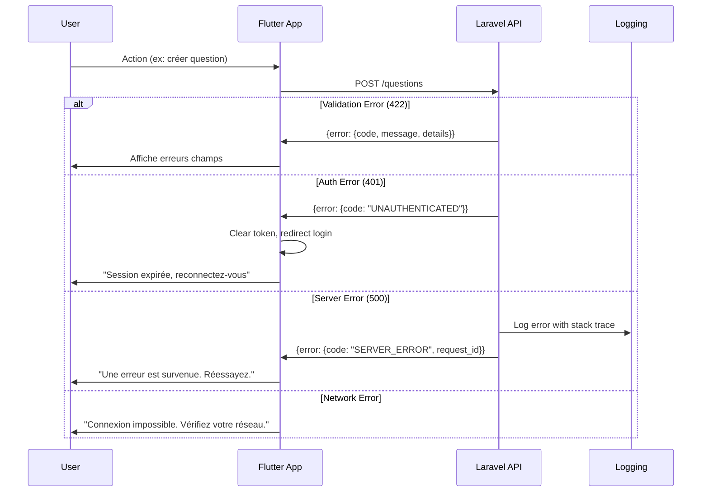

# 18. Stratégie de Gestion d'Erreurs

## 18.1 Flow d'Erreur



## 18.2 Format de Réponse d'Erreur

```typescript
interface ApiError {
  error: {
    code: string;           // VALIDATION_ERROR, UNAUTHENTICATED, FORBIDDEN, etc.
    message: string;        // Message lisible par l'utilisateur
    details?: Record<string, string[]>;  // Erreurs par champ (validation)
    timestamp: string;      // ISO 8601
    request_id: string;     // UUID pour le debugging
  };
}
```

## 18.3 Handler d'Erreurs Frontend

```dart
// core/error/error_handler.dart
class ErrorHandler {
  static String getErrorMessage(dynamic error) {
    if (error is DioException) {
      switch (error.type) {
        case DioExceptionType.connectionTimeout:
        case DioExceptionType.receiveTimeout:
          return 'La connexion a expiré. Réessayez.';
        case DioExceptionType.connectionError:
          return 'Impossible de se connecter. Vérifiez votre réseau.';
        case DioExceptionType.badResponse:
          final statusCode = error.response?.statusCode;
          final data = error.response?.data;

          if (statusCode == 401) {
            // Trigger logout
            return 'Session expirée. Reconnectez-vous.';
          }
          if (statusCode == 422 && data != null) {
            // Validation errors handled by form
            return data['error']['message'] ?? 'Données invalides';
          }
          if (statusCode == 429) {
            return 'Trop de requêtes. Patientez un moment.';
          }
          return data?['error']?['message'] ?? 'Une erreur est survenue';
        default:
          return 'Une erreur inattendue est survenue';
      }
    }
    return 'Une erreur est survenue';
  }
}
```

## 18.4 Handler d'Erreurs Backend

```php
<?php

// app/Exceptions/Handler.php (Laravel 11: bootstrap/app.php)
use Illuminate\Foundation\Configuration\Exceptions;
use Illuminate\Validation\ValidationException;
use Illuminate\Auth\AuthenticationException;
use Symfony\Component\HttpKernel\Exception\HttpException;

->withExceptions(function (Exceptions $exceptions) {
    $exceptions->render(function (Throwable $e, $request) {
        if ($request->expectsJson()) {
            $requestId = $request->header('X-Request-ID') ?? (string) Str::uuid();

            if ($e instanceof ValidationException) {
                return response()->json([
                    'error' => [
                        'code' => 'VALIDATION_ERROR',
                        'message' => 'Les données fournies sont invalides',
                        'details' => $e->errors(),
                        'timestamp' => now()->toISOString(),
                        'request_id' => $requestId,
                    ]
                ], 422);
            }

            if ($e instanceof AuthenticationException) {
                return response()->json([
                    'error' => [
                        'code' => 'UNAUTHENTICATED',
                        'message' => 'Authentification requise',
                        'timestamp' => now()->toISOString(),
                        'request_id' => $requestId,
                    ]
                ], 401);
            }

            if ($e instanceof HttpException) {
                return response()->json([
                    'error' => [
                        'code' => 'HTTP_ERROR',
                        'message' => $e->getMessage() ?: 'Erreur HTTP',
                        'timestamp' => now()->toISOString(),
                        'request_id' => $requestId,
                    ]
                ], $e->getStatusCode());
            }

            // Log server errors
            Log::error($e->getMessage(), [
                'request_id' => $requestId,
                'exception' => $e,
                'url' => $request->fullUrl(),
                'user_id' => $request->user()?->id,
            ]);

            return response()->json([
                'error' => [
                    'code' => 'SERVER_ERROR',
                    'message' => 'Une erreur interne est survenue',
                    'timestamp' => now()->toISOString(),
                    'request_id' => $requestId,
                ]
            ], 500);
        }
    });
})
```
