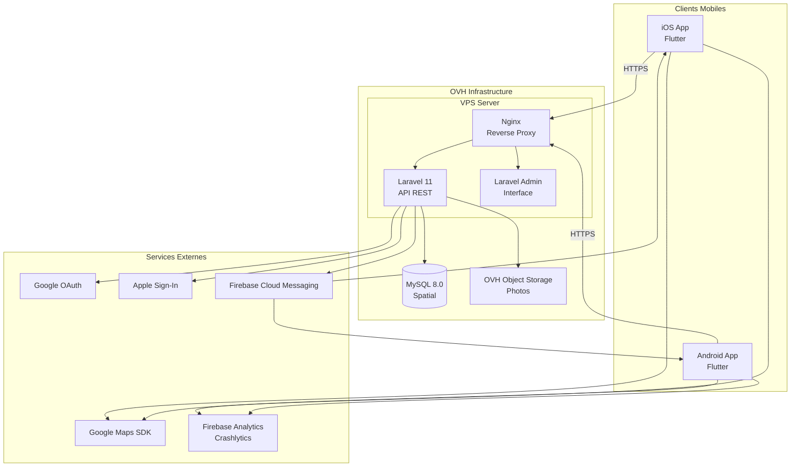

# 2. Architecture de Haut Niveau

## 2.1 Résumé Technique

TravelConnect adopte une architecture **monolithe modulaire** avec une application mobile Flutter cross-platform communiquant via API REST avec un backend Laravel. Cette approche pragmatique maximise la vélocité de développement pour un développeur solo tout en maintenant une séparation claire des responsabilités. L'infrastructure est hébergée sur OVH (VPS + Object Storage) pour optimiser les coûts, avec MySQL 8 exploitant les extensions spatiales pour les requêtes géolocalisées. Firebase Cloud Messaging assure les notifications push critiques pour l'engagement utilisateur, et Google Maps SDK fournit la cartographie interactive.

## 2.2 Plateforme et Infrastructure

**Plateforme :** OVH Cloud (Europe)

**Services Clés :**
- OVH VPS (Starter ou Essential) - Serveur applicatif
- OVH Object Storage - Stockage des photos de profil
- MySQL 8.0+ - Base de données avec extensions spatiales
- Firebase (Google Cloud) - FCM + Analytics + Crashlytics

**Régions de Déploiement :**
- Production : OVH Gravelines (France) - Latence acceptable pour le Japon via CDN
- Firebase : Région Asie-Pacifique pour les notifications

**Justification :** OVH offre le meilleur rapport qualité/prix pour le budget MVP, avec des serveurs européens conformes RGPD. La latence vers le Japon (~200ms) est acceptable pour une API REST avec mise en cache appropriée.

## 2.3 Structure des Repositories

**Structure : Polyrepo (2 repositories séparés)**

| Repository | Technologie | Description |
|------------|-------------|-------------|
| `travelconnect-api` | Laravel 11 (PHP 8.2+) | Backend API REST, Admin |
| `travelconnect-app` | Flutter 3.x (Dart 3.0+) | Application mobile iOS/Android |

**Justification :**
- Séparation claire backend/mobile
- Déploiement indépendant
- Pipelines CI/CD distincts
- Facilite l'ajout d'équipes séparées ultérieurement

## 2.4 Diagramme d'Architecture de Haut Niveau

## 2.5 Patterns Architecturaux

| Pattern | Description | Justification |
|---------|-------------|---------------|
| **Monolithe Modulaire** | Backend Laravel organisé en modules (Auth, Questions, Profils, Notifications) | Simplicité de déploiement, rapidité de développement pour un solo dev |
| **API REST** | Communication client-serveur via endpoints REST JSON | Standard mature, excellente documentation, outillage riche |
| **Repository Pattern** | Abstraction de l'accès aux données via Eloquent Repositories | Testabilité, flexibilité pour évolution future |
| **Service Layer** | Logique métier isolée dans des classes Service | Séparation des responsabilités, réutilisabilité |
| **BLoC Pattern (Flutter)** | Gestion d'état avec Business Logic Components | Pattern recommandé Flutter, séparation UI/logique |
| **Feature-First Structure** | Organisation du code Flutter par fonctionnalité | Scalabilité, maintenabilité |
