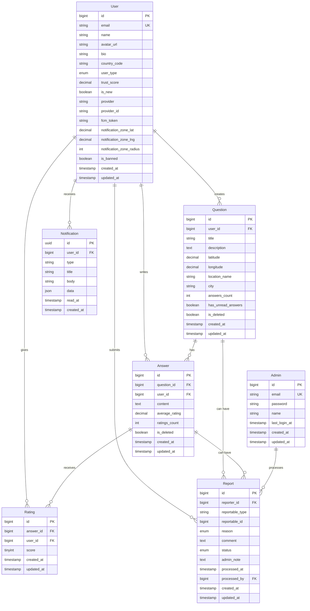

# 4. Modèles de Données

## 4.1 User (Utilisateur)

**Objectif :** Représente un utilisateur de l'application (Voyageur ou Local Supporter)

**Attributs Clés :**
- `id`: bigint - Identifiant unique auto-incrémenté
- `email`: string - Email unique (peut être relayé Apple)
- `name`: string - Nom d'affichage
- `avatar_url`: string|null - URL de la photo de profil
- `bio`: string|null - Bio courte (max 150 caractères)
- `country_code`: string - Code pays ISO (JP, FR, etc.)
- `user_type`: enum - 'traveler' ou 'local_supporter'
- `trust_score`: decimal(3,2) - Score de confiance calculé (0.00-5.00)
- `is_new`: boolean - Nouveau utilisateur (< 3 réponses notées)
- `provider`: string - Fournisseur OAuth (google, apple)
- `provider_id`: string - ID unique du provider
- `fcm_token`: string|null - Token Firebase Cloud Messaging
- `notification_zone_lat`: decimal|null - Latitude zone de notification
- `notification_zone_lng`: decimal|null - Longitude zone de notification
- `notification_zone_radius`: int|null - Rayon en km
- `is_banned`: boolean - Utilisateur banni
- `created_at`: timestamp
- `updated_at`: timestamp

```typescript
// Interface TypeScript (pour documentation)
interface User {
  id: number;
  email: string;
  name: string;
  avatar_url: string | null;
  bio: string | null;
  country_code: string;
  user_type: 'traveler' | 'local_supporter';
  trust_score: number;
  is_new: boolean;
  provider: 'google' | 'apple';
  provider_id: string;
  fcm_token: string | null;
  notification_zone_lat: number | null;
  notification_zone_lng: number | null;
  notification_zone_radius: number | null;
  is_banned: boolean;
  created_at: string;
  updated_at: string;
}
```

**Relations :**
- Has many Questions
- Has many Answers
- Has many Ratings (given)
- Has many Notifications
- Has many Reports (submitted)

---

## 4.2 Question

**Objectif :** Représente une question géolocalisée posée par un voyageur

**Attributs Clés :**
- `id`: bigint - Identifiant unique
- `user_id`: bigint - Auteur de la question (FK)
- `title`: string - Titre (max 100 caractères)
- `description`: text|null - Description détaillée (max 500 caractères)
- `latitude`: decimal(10,8) - Latitude
- `longitude`: decimal(11,8) - Longitude
- `location_name`: string|null - Nom du lieu (reverse geocoded)
- `city`: string|null - Ville pour filtrage
- `answers_count`: int - Compteur dénormalisé
- `has_unread_answers`: boolean - Pour l'auteur
- `is_deleted`: boolean - Soft delete
- `created_at`: timestamp
- `updated_at`: timestamp

```typescript
interface Question {
  id: number;
  user_id: number;
  title: string;
  description: string | null;
  latitude: number;
  longitude: number;
  location_name: string | null;
  city: string | null;
  answers_count: number;
  has_unread_answers: boolean;
  is_deleted: boolean;
  created_at: string;
  updated_at: string;
  // Relations
  user?: User;
  answers?: Answer[];
}
```

**Relations :**
- Belongs to User
- Has many Answers
- Has many Reports

---

## 4.3 Answer (Réponse)

**Objectif :** Représente une réponse à une question

**Attributs Clés :**
- `id`: bigint - Identifiant unique
- `question_id`: bigint - Question associée (FK)
- `user_id`: bigint - Auteur de la réponse (FK)
- `content`: text - Contenu (max 1000 caractères)
- `average_rating`: decimal(2,1)|null - Note moyenne
- `ratings_count`: int - Nombre de notes
- `is_deleted`: boolean - Soft delete
- `created_at`: timestamp
- `updated_at`: timestamp

```typescript
interface Answer {
  id: number;
  question_id: number;
  user_id: number;
  content: string;
  average_rating: number | null;
  ratings_count: number;
  is_deleted: boolean;
  created_at: string;
  updated_at: string;
  // Relations
  user?: User;
  question?: Question;
  user_rating?: number; // Note donnée par l'utilisateur courant
}
```

**Relations :**
- Belongs to Question
- Belongs to User
- Has many Ratings
- Has many Reports

---

## 4.4 Rating (Note)

**Objectif :** Note donnée à une réponse

**Attributs Clés :**
- `id`: bigint - Identifiant unique
- `answer_id`: bigint - Réponse notée (FK)
- `user_id`: bigint - Utilisateur qui note (FK)
- `score`: tinyint - Note de 1 à 5
- `created_at`: timestamp
- `updated_at`: timestamp

```typescript
interface Rating {
  id: number;
  answer_id: number;
  user_id: number;
  score: 1 | 2 | 3 | 4 | 5;
  created_at: string;
  updated_at: string;
}
```

**Relations :**
- Belongs to Answer
- Belongs to User

**Contrainte :** Un utilisateur ne peut noter une réponse qu'une seule fois (unique: answer_id, user_id)

---

## 4.5 Report (Signalement)

**Objectif :** Signalement de contenu inapproprié

**Attributs Clés :**
- `id`: bigint - Identifiant unique
- `reporter_id`: bigint - Utilisateur signalant (FK)
- `reportable_type`: string - Type de contenu (Question, Answer)
- `reportable_id`: bigint - ID du contenu signalé
- `reason`: enum - spam, offensive, false_info, other
- `comment`: text|null - Commentaire optionnel
- `status`: enum - pending, approved, rejected
- `admin_note`: text|null - Note de l'admin
- `processed_at`: timestamp|null
- `processed_by`: bigint|null - Admin qui a traité (FK)
- `created_at`: timestamp
- `updated_at`: timestamp

```typescript
interface Report {
  id: number;
  reporter_id: number;
  reportable_type: 'Question' | 'Answer';
  reportable_id: number;
  reason: 'spam' | 'offensive' | 'false_info' | 'other';
  comment: string | null;
  status: 'pending' | 'approved' | 'rejected';
  admin_note: string | null;
  processed_at: string | null;
  processed_by: number | null;
  created_at: string;
  updated_at: string;
}
```

**Relations :**
- Belongs to User (reporter)
- Morphs to Question or Answer (reportable)
- Belongs to Admin (processed_by)

---

## 4.6 Notification

**Objectif :** Notification utilisateur

**Attributs Clés :**
- `id`: uuid - Identifiant unique UUID
- `user_id`: bigint - Destinataire (FK)
- `type`: string - Type de notification
- `title`: string - Titre affiché
- `body`: string - Corps du message
- `data`: json - Données additionnelles (question_id, etc.)
- `read_at`: timestamp|null
- `created_at`: timestamp

```typescript
interface Notification {
  id: string;
  user_id: number;
  type: 'new_answer' | 'nearby_question';
  title: string;
  body: string;
  data: {
    question_id?: number;
    answer_id?: number;
  };
  read_at: string | null;
  created_at: string;
}
```

**Relations :**
- Belongs to User

---

## 4.7 Admin

**Objectif :** Compte administrateur (séparé des utilisateurs)

**Attributs Clés :**
- `id`: bigint - Identifiant unique
- `email`: string - Email unique
- `password`: string - Hash bcrypt
- `name`: string - Nom
- `last_login_at`: timestamp|null
- `created_at`: timestamp
- `updated_at`: timestamp

---

## 4.8 Diagramme Entité-Relation


