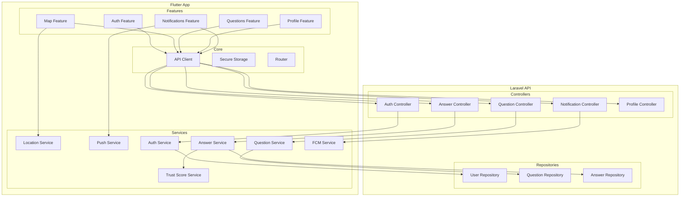

# 6. Composants

## 6.1 Backend - Laravel API

## 6.1.1 Auth Module

**Responsabilité :** Gestion de l'authentification OAuth et des sessions

**Interfaces Clés :**
- `AuthController` : Endpoints Google/Apple Sign-In, logout
- `AuthService` : Logique de vérification tokens, création utilisateurs
- `SocialiteProviders` : Configuration Google/Apple

**Dépendances :** Laravel Sanctum, Socialite

**Technologies :** PHP 8.2, Laravel 11

---

## 6.1.2 Questions Module

**Responsabilité :** CRUD questions, requêtes géospatiales

**Interfaces Clés :**
- `QuestionController` : Endpoints REST
- `QuestionService` : Logique métier
- `QuestionRepository` : Accès données avec requêtes spatiales

**Dépendances :** MySQL Spatial Functions

**Technologies :** Eloquent ORM, MySQL 8 Spatial

---

## 6.1.3 Answers Module

**Responsabilité :** Réponses et système de notation

**Interfaces Clés :**
- `AnswerController` : Endpoints REST
- `AnswerService` : Logique métier, calcul moyennes
- `RatingService` : Gestion des notes, mise à jour trust score

**Dépendances :** Questions Module

---

## 6.1.4 Notifications Module

**Responsabilité :** Envoi notifications push, stockage historique

**Interfaces Clés :**
- `NotificationController` : Endpoints REST
- `NotificationService` : Logique d'envoi
- `FCMService` : Intégration Firebase Cloud Messaging

**Dépendances :** Firebase Admin SDK

---

## 6.1.5 Admin Module

**Responsabilité :** Interface d'administration

**Interfaces Clés :**
- `AdminController` : Dashboard, login
- `ModerationController` : Gestion signalements
- `UserManagementController` : Gestion utilisateurs

**Dépendances :** Laravel Blade (views)

---

## 6.2 Frontend - Flutter App

## 6.2.1 Auth Feature

**Responsabilité :** Écrans login, gestion tokens

**Composants :**
- `LoginScreen` : UI login
- `AuthBloc` : Gestion état authentification
- `AuthRepository` : Communication API auth

**Dépendances :** google_sign_in, sign_in_with_apple, flutter_secure_storage

---

## 6.2.2 Map Feature

**Responsabilité :** Carte interactive, marqueurs questions

**Composants :**
- `MapScreen` : Vue carte principale
- `MapBloc` : Gestion état carte
- `QuestionMarker` : Widget marqueur personnalisé
- `LocationService` : Gestion géolocalisation

**Dépendances :** google_maps_flutter, geolocator

---

## 6.2.3 Questions Feature

**Responsabilité :** Liste questions, détail, création

**Composants :**
- `QuestionListScreen` : Fil d'actualité
- `QuestionDetailScreen` : Détail question + réponses
- `CreateQuestionScreen` : Formulaire création
- `QuestionsBloc` : Gestion état questions

---

## 6.2.4 Profile Feature

**Responsabilité :** Profil utilisateur, édition

**Composants :**
- `ProfileScreen` : Vue profil
- `EditProfileScreen` : Édition profil
- `ProfileBloc` : Gestion état profil

---

## 6.2.5 Notifications Feature

**Responsabilité :** Centre notifications, push

**Composants :**
- `NotificationCenterScreen` : Liste notifications
- `NotificationsBloc` : Gestion état
- `PushNotificationService` : Intégration FCM

**Dépendances :** firebase_messaging, flutter_local_notifications

---

## 6.3 Diagramme des Composants

