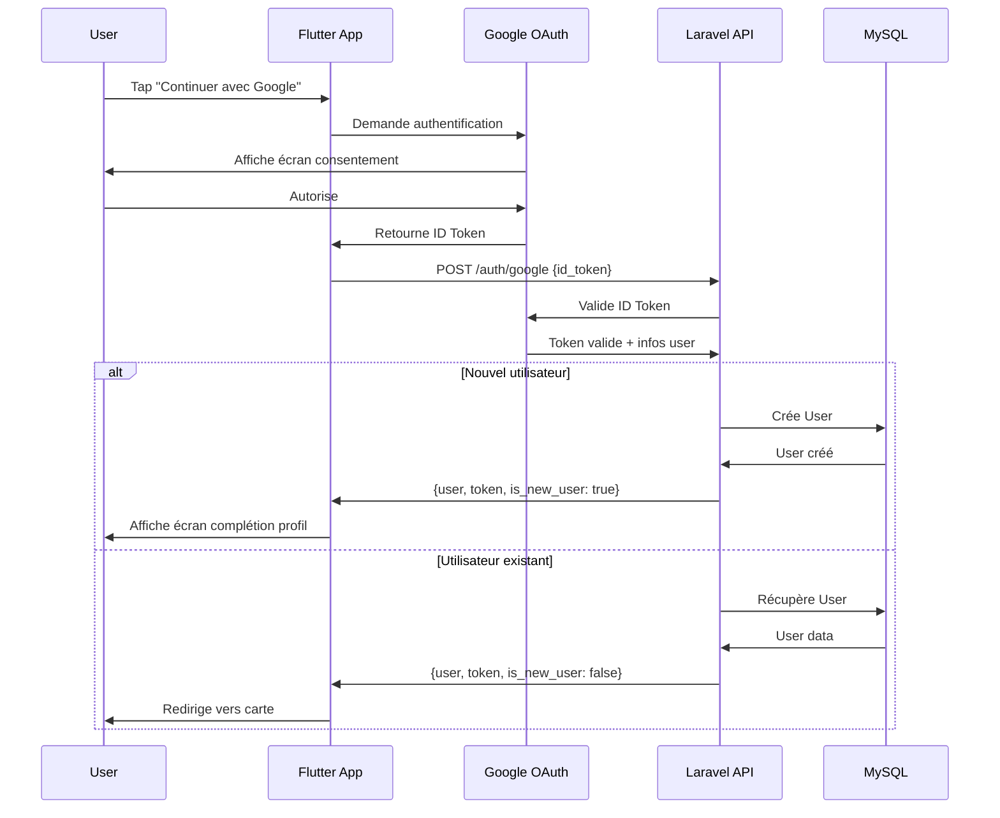
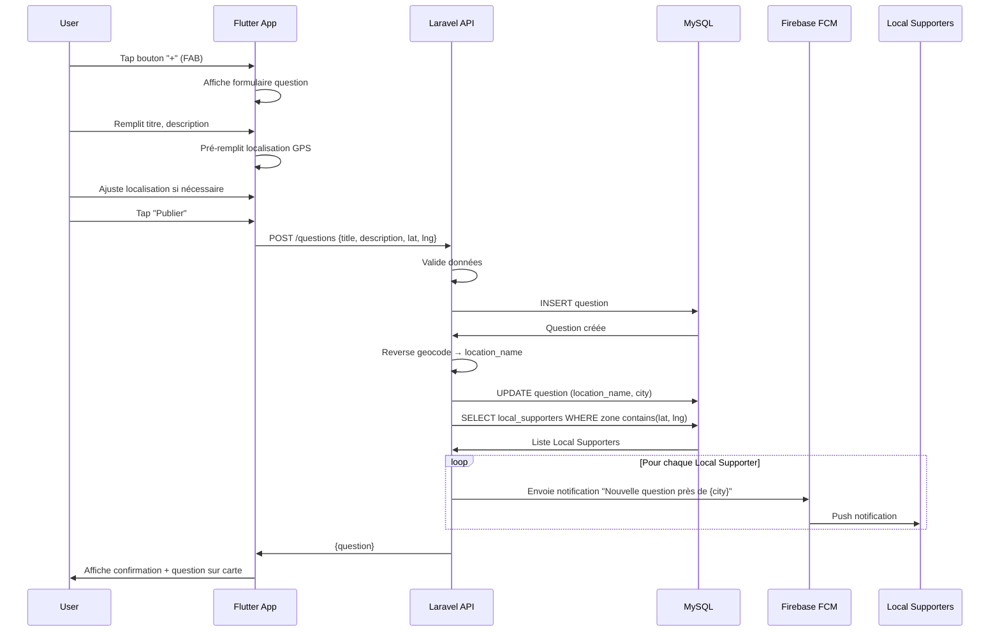
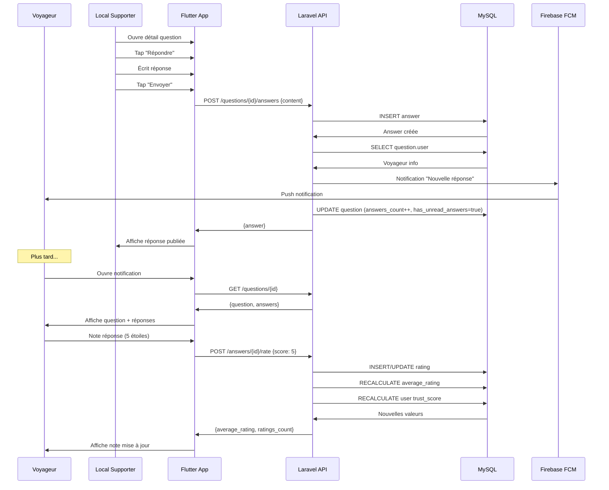
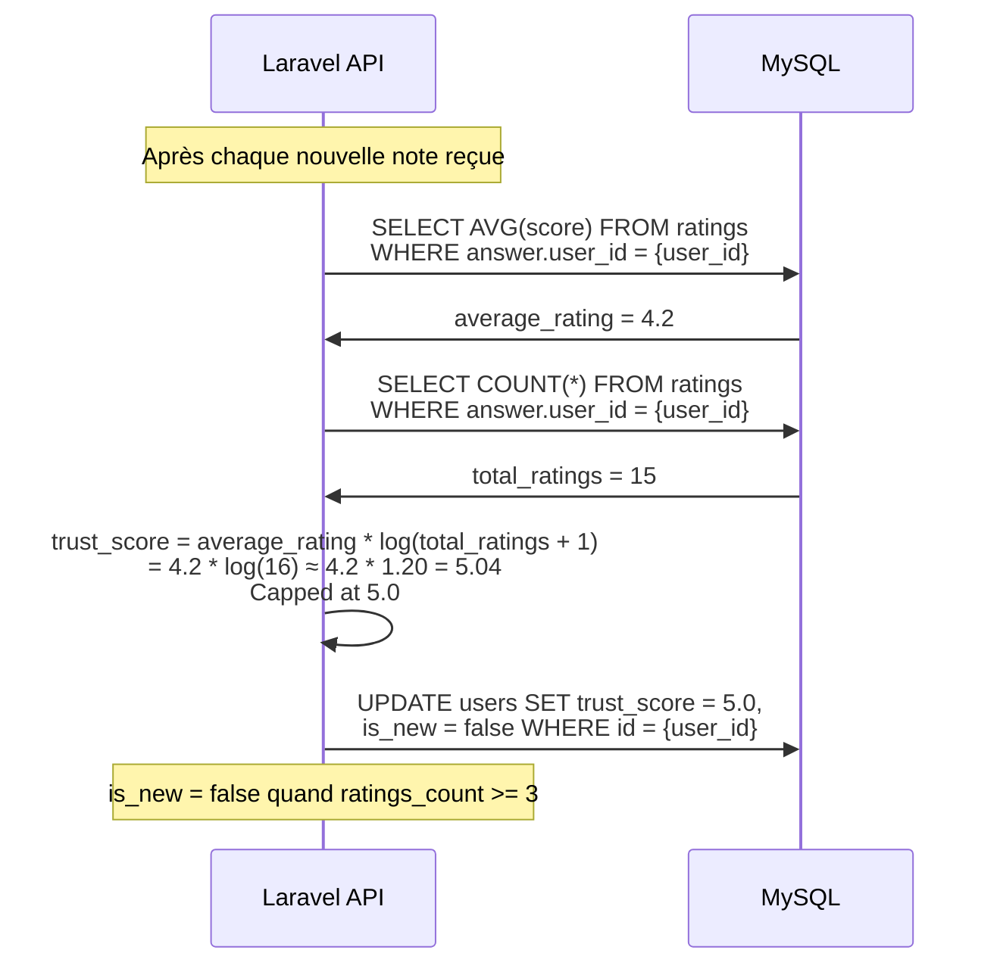

# 8. Workflows Principaux

## 8.1 Authentification Google

```mermaid
sequenceDiagram
    participant U as User
    participant App as Flutter App
    participant Google as Google OAuth
    participant API as Laravel API
    participant DB as MySQL

    U->>App: Tap "Continuer avec Google"
    App->>Google: Demande authentification
    Google->>U: Affiche écran consentement
    U->>Google: Autorise
    Google->>App: Retourne ID Token
    App->>API: POST /auth/google {id_token}
    API->>Google: Valide ID Token
    Google->>API: Token valide + infos user

    alt Nouvel utilisateur
        API->>DB: Crée User
        DB->>API: User créé
        API->>App: {user, token, is_new_user: true}
        App->>U: Affiche écran complétion profil
    else Utilisateur existant
        API->>DB: Récupère User
        DB->>API: User data
        API->>App: {user, token, is_new_user: false}
        App->>U: Redirige vers carte
    end
```

---

## 8.2 Publication d'une Question

```mermaid
sequenceDiagram
    participant U as User
    participant App as Flutter App
    participant API as Laravel API
    participant DB as MySQL
    participant FCM as Firebase FCM
    participant LS as Local Supporters

    U->>App: Tap bouton "+" (FAB)
    App->>App: Affiche formulaire question
    U->>App: Remplit titre, description
    App->>App: Pré-remplit localisation GPS
    U->>App: Ajuste localisation si nécessaire
    U->>App: Tap "Publier"

    App->>API: POST /questions {title, description, lat, lng}
    API->>API: Valide données
    API->>DB: INSERT question
    DB->>API: Question créée
    API->>API: Reverse geocode → location_name
    API->>DB: UPDATE question (location_name, city)

    API->>DB: SELECT local_supporters WHERE zone contains(lat, lng)
    DB->>API: Liste Local Supporters

    loop Pour chaque Local Supporter
        API->>FCM: Envoie notification "Nouvelle question près de {city}"
        FCM->>LS: Push notification
    end

    API->>App: {question}
    App->>U: Affiche confirmation + question sur carte
```

---

## 8.3 Réponse et Notation

```mermaid
sequenceDiagram
    participant Traveler as Voyageur
    participant Local as Local Supporter
    participant App as Flutter App
    participant API as Laravel API
    participant DB as MySQL
    participant FCM as Firebase FCM

    Local->>App: Ouvre détail question
    Local->>App: Tap "Répondre"
    Local->>App: Écrit réponse
    Local->>App: Tap "Envoyer"

    App->>API: POST /questions/{id}/answers {content}
    API->>DB: INSERT answer
    DB->>API: Answer créée

    API->>DB: SELECT question.user
    DB->>API: Voyageur info
    API->>FCM: Notification "Nouvelle réponse"
    FCM->>Traveler: Push notification

    API->>DB: UPDATE question (answers_count++, has_unread_answers=true)
    API->>App: {answer}
    App->>Local: Affiche réponse publiée

    Note over Traveler: Plus tard...

    Traveler->>App: Ouvre notification
    App->>API: GET /questions/{id}
    API->>App: {question, answers}
    App->>Traveler: Affiche question + réponses

    Traveler->>App: Note réponse (5 étoiles)
    App->>API: POST /answers/{id}/rate {score: 5}
    API->>DB: INSERT/UPDATE rating
    API->>DB: RECALCULATE average_rating
    API->>DB: RECALCULATE user trust_score
    DB->>API: Nouvelles valeurs
    API->>App: {average_rating, ratings_count}
    App->>Traveler: Affiche note mise à jour
```

---

## 8.4 Calcul du Trust Score

```mermaid
sequenceDiagram
    participant API as Laravel API
    participant DB as MySQL

    Note over API: Après chaque nouvelle note reçue

    API->>DB: SELECT AVG(score) FROM ratings<br/>WHERE answer.user_id = {user_id}
    DB->>API: average_rating = 4.2

    API->>DB: SELECT COUNT(*) FROM ratings<br/>WHERE answer.user_id = {user_id}
    DB->>API: total_ratings = 15

    API->>API: trust_score = average_rating * log(total_ratings + 1)<br/>= 4.2 * log(16) ≈ 4.2 * 1.20 = 5.04<br/>Capped at 5.0

    API->>DB: UPDATE users SET trust_score = 5.0,<br/>is_new = false WHERE id = {user_id}

    Note over API: is_new = false quand ratings_count >= 3
```
